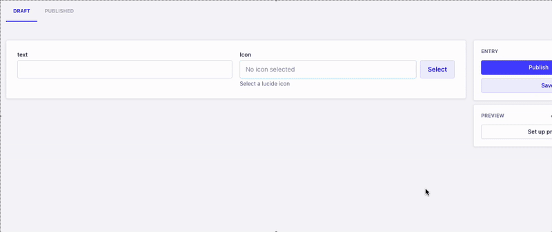

# Lucide Icon Picker for Strapi

A Strapi v5 custom field plugin that provides an intuitive icon picker for Lucide icons. Icons are stored as kebab-case strings and accessible via the Strapi API.




## ✨ Features

- 🎨 **Visual Icon Browser** - Browse through 1600+ Lucide icons with live preview
- 📂 **Category Organization** - Icons grouped by categories (Design, Text, Communication, etc.)
- 🔍 **Smart Search** - Filter icons by name, tags, and categories
- 🌙 **Dark Mode Support** - Seamless integration with Strapi's dark theme
- 💾 **String Storage** - Icons stored as kebab-case strings (e.g., "arrow-down")
- 🌐 **API Ready** - Access icon names through Strapi's REST & GraphQL APIs
- ✅ **TypeScript Support** - Full type safety and IntelliSense
- 📱 **Responsive Design** - Works seamlessly across all device sizes
- ⚡ **Auto-sync** - Automatically downloads latest icons from Lucide before building
- 🎯 **Enhanced UX** - Tooltips and improved visual feedback

## 🚀 Installation

1. Install the plugin in your Strapi project:

```bash
npm install lucide-icon-picker
```

2. Enable the plugin in `config/plugins.js`:

```javascript
module.exports = () => ({
  'lucide-icon-picker': {
    enabled: true,
  },
});
```

3. Rebuild and restart your Strapi application:

```bash
npm run build
npm run develop
```

## 📖 Usage

### Adding Icon Fields

1. Navigate to **Content-Type Builder**
2. Select an existing content type or create a new one
3. Click **Add another field**
4. Choose **Custom** → **Lucide Icon**
5. Configure your field settings and save

### Content Management

The icon picker provides an intuitive interface where you can:
- Browse icons in a grid layout
- Search by icon name
- Preview icons in real-time
- Clear selections easily

### Frontend Integration

Use the included `ApiIcon` component to display icons in your React application:

```tsx
import { ApiIcon } from 'lucide-react';

// In your component
function ArticleCard({ article }) {
  return (
    <div>
      <ApiIcon apiName={article.icon} size={24} />
      <h2>{article.title}</h2>
    </div>
  );
}
```

### API Response Format

Icons are returned as kebab-case strings in your API responses:

```json
{
  "data": {
    "id": 1,
    "attributes": {
      "title": "My Article",
      "icon": "arrow-down",
      "publishedAt": "2024-01-15T10:00:00.000Z"
    }
  }
}
```

## 🎨 Available Icons

This plugin supports all icons from the [Lucide icon library](https://lucide.dev/icons/), including:

- Interface icons (arrows, buttons, controls)
- Communication icons (mail, phone, chat)
- Media icons (play, pause, volume)
- File and folder icons
- And many more...

## 🛠 Development

### Requirements

- Node.js >= 18
- Strapi v5.x
- React 18+

### Building the Plugin

```bash
# Install dependencies
npm install

# Build the plugin
npm run build

# Run TypeScript checks
npm run test:ts:front
npm run test:ts:back

# Watch for changes during development
npm run watch
```

### Testing

The plugin can be tested locally using Yalc:

```bash
# In the plugin directory
npm run build
npx yalc publish

# In your Strapi project
npx yalc add lucide-icon-picker
npm install
npm run develop
```

## 🤝 Contributing

Contributions are welcome! Please feel free to submit issues and enhancement requests.

## 📄 License

MIT License - see LICENSE file for details.

## 🙏 Acknowledgments

- Built with the [Strapi Plugin SDK](https://github.com/strapi/sdk-plugin)
- Icons provided by [Lucide](https://lucide.dev/)
- Inspired by the Strapi community's needs for better icon management
